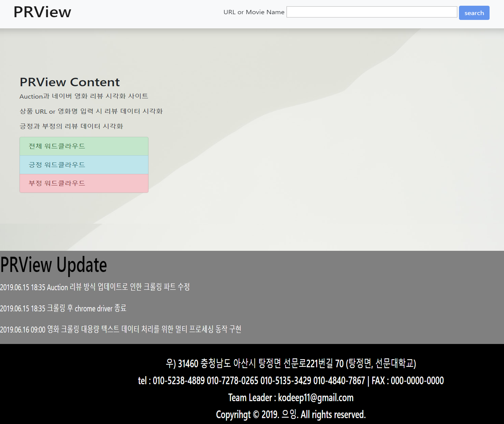
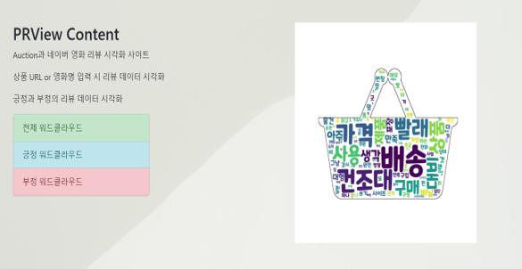
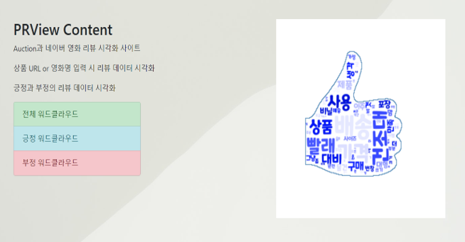
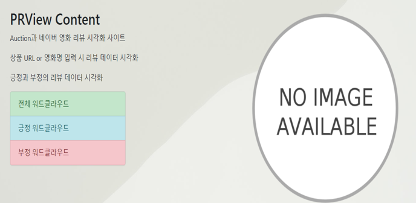
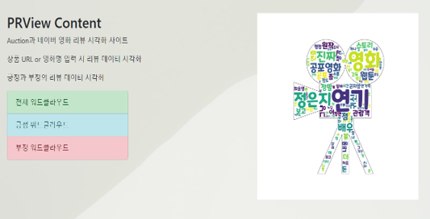
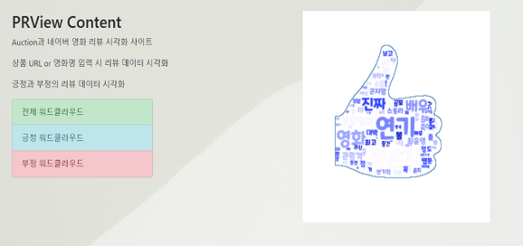
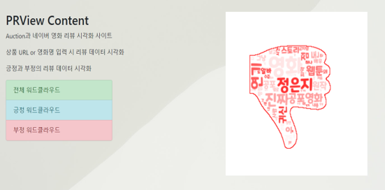

# 🔍 PRView - 리뷰 데이터 시각화 웹 서비스

> 상품 및 영화 리뷰 데이터를 크롤링·자연어 처리하여 워드 클라우드로 시각화하는 Django 기반 웹 서비스

<br>

## 📌 목차

- [프로젝트 개요](#-프로젝트-개요)
- [팀 구성 및 역할](#-팀-구성-및-역할)
- [기술 스택](#-기술-스택)
- [주요 기능](#-주요-기능)
- [시스템 흐름](#-시스템-흐름)
- [요구사항 구현 현황](#-요구사항-구현-현황)
- [실행 결과](#-실행-결과)
- [설치 및 실행 방법](#-설치-및-실행-방법)

<br>

## 📖 프로젝트 개요

<table>
  <thead>
    <tr>
      <th width="120" align="center">항목</th>
      <th>내용</th>
    </tr>
  </thead>
  <tbody>
    <tr>
      <td align="center">프로젝트명</td>
      <td>PRView (Product & Movie Review Visualization)</td>
    </tr>
    <tr>
      <td align="center">개발 기간</td>
      <td>2019년 1학기 - 학사 3년차</td>
    </tr>
    <tr>
      <td align="center">개발 인원</td>
      <td>4명</td>
    </tr>
    <tr>
      <td align="center">배포 서버</td>
      <td>PythonAnywhere</td>
    </tr>
    <tr>
      <td align="center">프로젝트 소개</td>
      <td>옥션 상품 리뷰와 네이버 영화 리뷰를 크롤링하여 자연어 처리 후 워드 클라우드 이미지로 시각화하는 웹 서비스 <br> 사용자가 상품 URL 또는 영화명을 입력하면 전체·긍정·부정 리뷰를 분석해 시각화 결과를 제공한다.</td>
    </tr>
  </tbody>
</table>

<br>

## 👥 팀 구성 및 역할

<table>
  <thead>
    <tr>
      <th width="80" style="text-align:center">이름</th>
      <th width="100" style="text-align:center">역할</th>
      <th style="text-align:center">작업</th>
    </tr>
  </thead>
  <tbody>
    <tr>
      <td align="center">채윤재</td>
      <td align="center">팀장</td>
      <td>Front-end 개발 (HTML/CSS/Bootstrap)<br>Back-end 개발 (Django Views, URL 라우팅)<br>프로젝트 통합 및 관리</td>
    </tr>
    <tr>
      <td align="center">지하린</td>
      <td align="center">팀원</td>
      <td>데이터 시각화 (WordCloud)<br>이미지 마스킹</td>
    </tr>
    <tr>
      <td align="center">박문영</td>
      <td align="center">팀원</td>
      <td>자연어 처리 (KoNLPy 형태소 분석)<br>데이터 시각화</td>
    </tr>
    <tr>
      <td align="center">장우성</td>
      <td align="center">팀원</td>
      <td>웹 크롤링 (Selenium, BeautifulSoup4)</td>
    </tr>
  </tbody>
</table>

<br>

## 🛠 기술 스택

| 분류 | 기술 |
|------|------|
| 개발환경 |   |
| 언어 |  |
| 프레임워크 |  |
| DB |  |
| 크롤링 |   |
| NLP |  |
| 시각화 |  |
| 배포 |  |

<br>

## ✨ 주요 기능

### 1. 크롤링

사용자가 입력한 상품 URL 또는 영화명을 기반으로 Selenium 웹드라이버를 통해 동적 크롤링을 수행한다.

- **상품 리뷰 크롤링**: 옥션 사이트 상품 URL 입력 → 전체 / 긍정 / 부정 리뷰 데이터 수집
- **영화 리뷰 크롤링**: 네이버 영화 영화명 입력 → 전체 / 긍정 / 부정 리뷰 데이터 수집
- 수집 결과는 `.txt` 파일 3개로 저장

### 2. 자연어 처리

크롤링된 `.txt` 파일을 KoNLPy로 형태소 분석하여 명사를 추출하고 단어 빈도수를 딕셔너리 형태로 반환한다.

- 전체 리뷰 / 긍정 단어 / 부정 단어 3가지 데이터셋 처리
- Multiprocessing으로 대용량 데이터 처리 속도 개선

### 3. 데이터 시각화

자연어 처리된 딕셔너리를 WordCloud 라이브러리로 시각화하고, 주제별 마스킹 이미지를 적용해 워드 클라우드를 생성한다.

- 생성된 이미지는 지정 폴더에 저장
- 전체 / 긍정 / 부정 3종류의 워드 클라우드 이미지 생성

### 4. Front-end / Back-end

- HTML + CSS + Bootstrap으로 웹 UI 개발
- Django Template으로 Python 로직과 연동
- SQLite3로 상품 URL DB 및 영화명 DB 모델링
- 입력 문자열 길이(20자 기준)로 상품/영화 자동 분류
- 크롤링 데이터 없을 경우 에러 이미지 호출 및 기존 이미지 삭제 처리

<br>

## 🔄 시스템 흐름

```
사용자 입력 (상품 URL 또는 영화명)
  → 문자열 길이 판별 (> 20: 상품 / ≤ 20: 영화)
  → Selenium 크롤링 (전체 / 긍정 / 부정 .txt 저장)
  → KoNLPy 자연어 처리 (명사 추출 → 빈도수 딕셔너리)
  → WordCloud 시각화 (마스킹 이미지 적용)
  → 결과 이미지 폴더 저장 → 결과 화면 출력
```

<br>

## ✅ 요구사항 구현 현황

| 요구사항 ID | 내용 | 구현 | 테스트 |
|---|---|:---:|:---:|
| PRV_1_RD | 쇼핑몰·영화 리뷰 데이터 수집 | ✅ | ✅ |
| PRV_2_NLP | 자연어 처리를 통한 명사/빈도 데이터 수집 | ✅ | ✅ |
| PRV_3_DV | 단어 데이터를 이용한 데이터 시각화 | ✅ | ✅ |
| PRV_4_UI | 데이터 시각화 UI 디자인 설계 | ✅ | ✅ |
| PRV_5_DB | 상품 URL·영화명 DB 모델링 | ✅ | ✅ |
| PRV_6_Views | 각 html 처리 기능 설계 | ✅ | ✅ |
| PRV_7_Update_Crawling | 쇼핑몰 업데이트에 따른 크롤링 업데이트 | ✅ | ✅ |
| 이전 이미지 재열람 기능 | 생성된 이미지 다시 보기 | ❌ | - |

<br>

## 🖥 실행 결과

### 메인 화면


### 상품 리뷰 결과 (전체 / 긍정 / 부정 / 에러)



> ⚠️ 부정 리뷰 데이터가 존재하지 않아 부정 워드 클라우드 이미지가 생성되지 않을 수 있습니다




### 영화 리뷰 결과 (전체 / 긍정 / 부정 / 에러)





<br>

## 🚀 설치 및 실행 방법

### 1. 레포 클론

```bash
git clone https://github.com/GroovyCat/PRView-project.git
cd PRView-project
```

### 2. 가상환경 생성 및 활성화

```bash
python -m venv venv
source venv/bin/activate  # Windows: venv\Scripts\activate
```

### 3. 의존성 설치

```bash
pip install -r requirements.txt
```

### 4. DB 마이그레이션

```bash
python manage.py migrate
```

### 5. 서버 실행

```bash
python manage.py runserver
```
